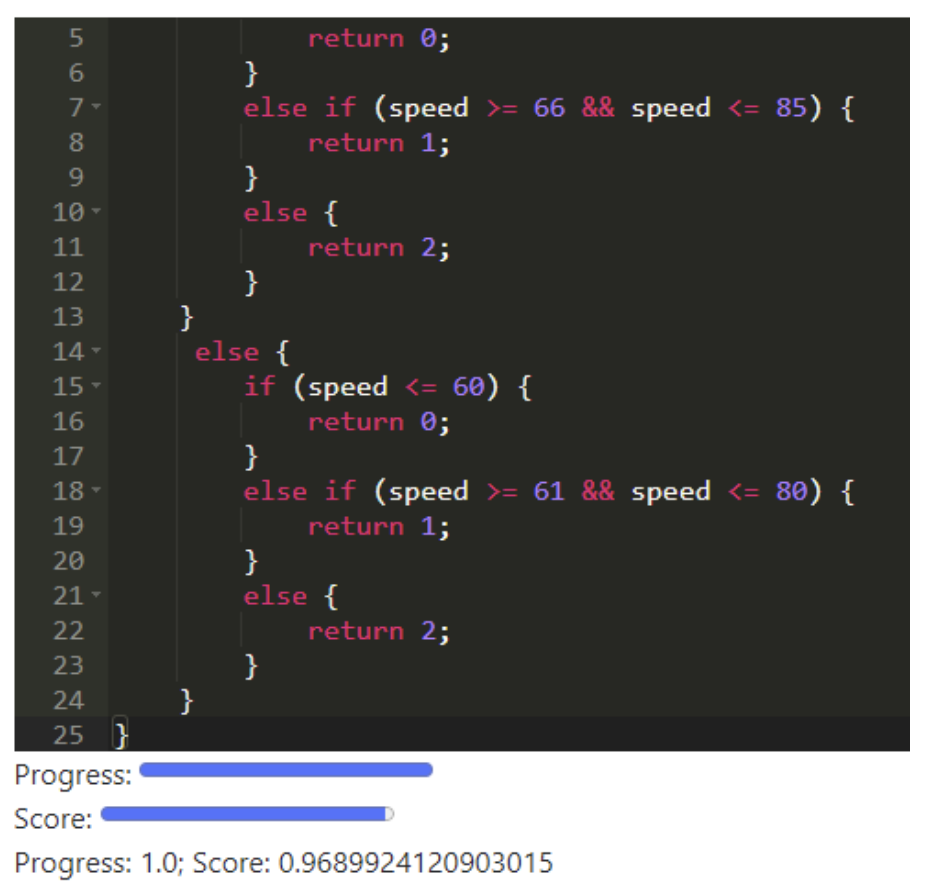

# Scaling Programming Interventions FAQ

----
## Why should I get involved in this project - why is it awesome?

What if you could go to SIGCSE, see a great paper about an intervention that improved students’ outcomes during programming practice, and use it in your course the next week? Or run a replication study (measures included) in your course and publish a paper on it? The goal of this project is to make it as straightforward as possible to replicate and scale interventions (e.g., hints, feedback, resource recommendations, metacognitive scaffolding) that occur during programming practice.
  
- Motivation
    - This helps **instructors** by allowing them to use state-of-the-art interventions more easily.
    - It helps **researchers** by getting them more data as they scale their interventions, and allowing them to replicate others’ work more easily.
    - It helps **science** by enabling more easy replication studies in diverse course contexts to understand what actually makes an intervention work!
- Novelty: Replication studies are exceedingly rare in computing education. Two major reasons are lack of opportunity and difficulty in replication due to lack of technical details ([Ahadi et al, 2016]). We solve those problems.
  
**Long-term Goal:** The long-term vision is that we will have an app store for programming practice (or even CS Ed), that is compatible with most classroom contexts, which enables this to happen.

----
## What is the specific aim of this project?
**Short-term Goal:** Replicate a study of (at least) one [programming practice intervention] across at least 2 classrooms with different programming contexts/platforms using the same codebase.

This replication study would have two important outcomes:
- A protocol for the programming practice environment (PPE) to communicate with the intervention, which could be used with other interventions and PPEs.
- A high-quality replication paper (or set of papers) that helps advance Computing Education Research.
  

----
## Can you give me a specific example?

The first intervention we plan to replicate is Adaptive Immediate Feedback intervention ([Marwan et al., 2022]). The original AIF system breaks students' problems down into subgoals, and automatically monitors and displays their progress on each subgoal, displaying positive feedback when students progress. AIF [helped university students perform better] on programming practice problems, and in [another study] helped improve younger students' engagement and intention to persist in computing.

AIF was embedded in the Snap programming environment, and tightly coupled with it. What if we could decouple it from the practice environment and replicate that evaluation in other classrooms?

We are currently working on doing so for a simplified version of AIF, which can work with any text- or block-based programming language.


----
## What collaborators are you looking for?
We are looking for three types of collaborators:

- **CS Ed Researchers / Tool Developers** who have an intervention that they would like to replicate across other classrooms.

**Developers of Programming Practice Environments** who are interested in supporting their users to run interventions and replications that other researchers develop.
**Instructors** who are interested in using others' interventions in their classroom, and especially in running a replication study in their classroom.

Sometimes these groups overlap - we are especially interested if you play more than one of these roles.


----
## What kinds of learning environments are you talking about?
We're currently working with [programming practice environments] - places where students practice writing program code. This could include:

Professional IDEs (e.g., VS Code, Eclipse, IntelliJ).
Web-based, "online judge"-style environments where students practice one problem at a time, often with test-case feedback (e.g., [CodeWorkout], [Snap], [BlockPy], [Codespec]).
CS e-Textbooks (e.g., [Runestone], [OLI], [FiTech] courses).

In all cases, environments need to either support plug-ins, or have developers willing to work with us (e.g., those developed in academic settings).


----
## What kinds of interventions are you talking about?
Any intervention that occurs right before, during, or right after students practice a programming problem, and which can be displayed in the programming environment (e.g., by displaying information/HTML, highlighting or annotating code, linking to a resource, pausing submission or editing, etc.). 

Examples include:
- Automated hints or feedback
- Metacognitive scaffolding before coding (e.g., asking students to submit a correct input/output pair)
- Detecting struggle and suggesting potential sources of help
- Open learner modeling
- Replacing a challenging problem with a Parsons problem or worked example
- And much, much more!
    

----
## What might communications between the programming practice environment and the intervention look like?
Below is a very draft outline of what a communications protocol might look like.

The protocol focuses on two things:

- **Events:** When does the intervention do something? E.g., On compilation, edit, starting a problem, getting feedback, etc. Events can include parameters / data (e.g., student code, test case scores)
- **Actions:** What does the intervention do? How does it interact with the student/instructor? E.g., Show information, disable submitting, highlight code, annotate code.


The client (programming practice environment) has a config file that defines which interventions it's currently supporting. For each intervention, it knows which [ProgSnap2] events (e.g., Submit, or File.Edit) that intervention listens for, and which URLs to call out to when those events occur. This config could be hard coded, or fetched from a server. Something like this:

``` python
export const config = {
    problems: {
        "1": "sortaSum",
        "13": "caughtSpeeding",
    },
    endpoints: {
        "SimpleAIF": {
            baseUrl: "http://localhost:5000/",
            events: {
                "Submit": "Submit/",
                "File.Edit": "FileEdit/",
            },
        }
    }
}
```


When an event occurs in the IDE that it known an intervention is listening listening for, it gathers the relevant [ProgSnap2] "columns" for that event, and sends them over to the intervention's endpoint as a POST. Here's the JSON blob that was sent to the /FileEdit/ endpoint in my example.


``` python
{
    "ToolInstances": "SimpleIDE-1.0",
    "CourseID": "Test101",
    "AssignmentID": "Assignment01",
    "EventID": "4",
    "SubjectID": "",
    "ClientTimestamp": "Tue May 16 2023",
    "ProblemID": "13",
    "Attempt": 0,
    "CodeState": "public int caughtSpeeding(int speed, boolean isBirthday)\n{\n    if (isBirthday) {\n        if (speed <= 65) {\n            return 0;\n        }\n        else if (speed >= 66 && speed <= 85) {\n            return 1;\n        }\n        else {\n            return 2;\n        }\n    }\n     else {\n        if (speed <= 60) {\n            return 0;\n        }\n        else if (speed >= 61 && speed <= 80) {\n            return 1;\n        }\n        else {\n            return 2;\n        }\n    }\n}"
} 
```


The server (in this case the simple feedback server I demoed earlier) does some computation and sends back a list of actions that the IDE can perform, with parameters. In this case, it asks the IDE to show a div with some progress information. 

``` python
[
{
    "action": "ShowDiv",
    "data": {
        "html": "\n<label for=\"progress\">Progress:</label>\n<progress id=\"progress\" value=\"100.0\" max=\"100\"></progress> <br/>\n<label for=\"score\">Score:</label>\n<progress id=\"score\" value=\"96.89924120903015\" max=\"100\"></progress> <br/>\nProgress: 1.0; Score: 0.9689924120903015\n"
    }
}
]
```

The end results looks something like this:




[Ahadi et al, 2016]: https://dl.acm.org/doi/pdf/10.1145/2999541.2999554
[programming practice intervention]: https://docs.google.com/document/d/1-YMHl3KQErAJOySy79quvxdcfHpj4OxEq75D44zfYgc/edit#heading=h.1p8lsco03dwu
[Marwan et al. 2022]: https://ieeexplore.ieee.org/stamp/stamp.jsp?arnumber=9792163
[helped university students perform better]: https://dl.acm.org/doi/pdf/10.1145/3372782.3406264
[another study]: https://dl.acm.org/doi/pdf/10.1145/3372782.3406264
[CodeWorkout]: https://codeworkout.cs.vt.edu/
[Snap]: https://snap.berkeley.edu/
[BlockPy]: https://landing.runestone.academy/
[Codespec]: https://www.codespec.org/
[Runestone]: https://landing.runestone.academy/
[OLI]: https://oli.cmu.edu/
[FiTech]: https://fitech.io/en/studying-at-fitech/universities/aalto-university/
[ProgSnap2]: https://docs.google.com/document/d/1bZPu8LIUPOfobWsCO_9ayi5LC9_1wa1YCAYgbKGAZfA/edit#